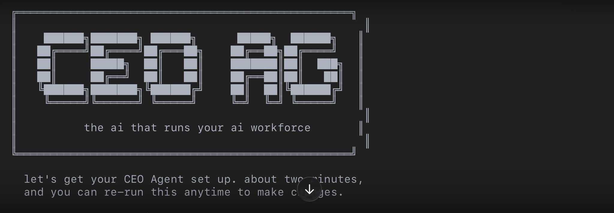
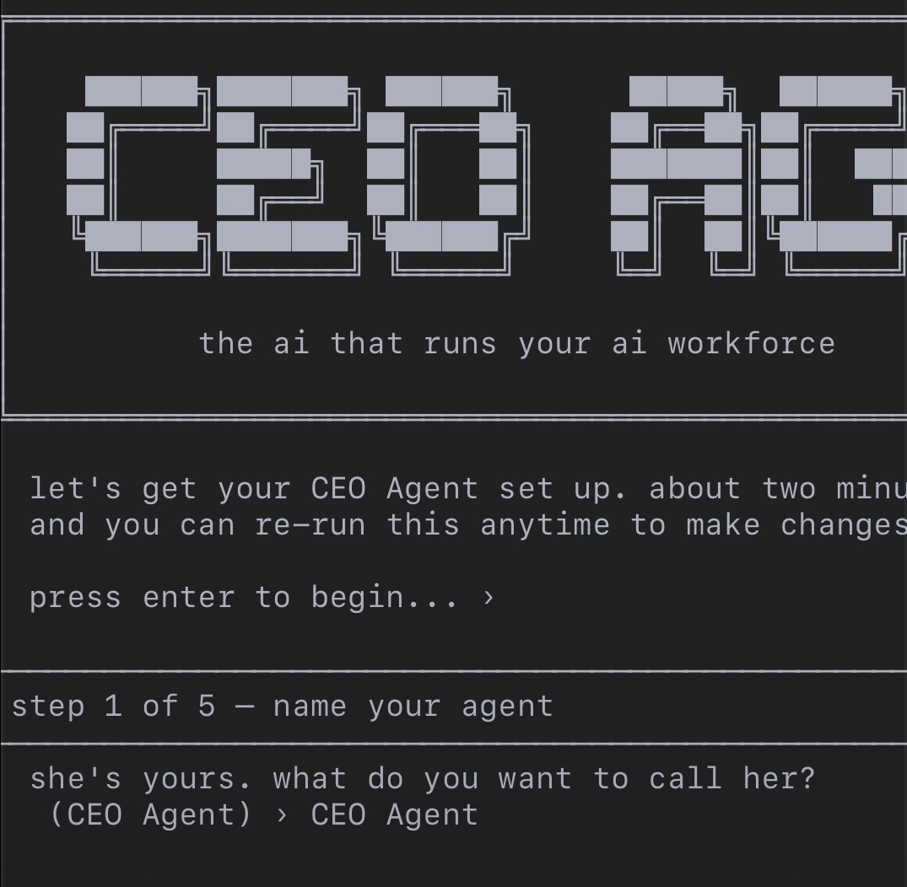
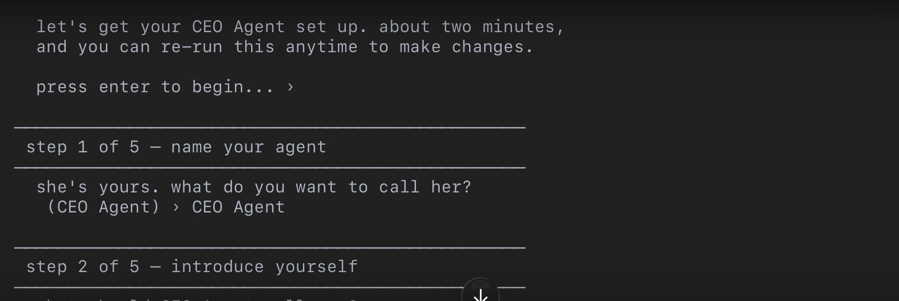
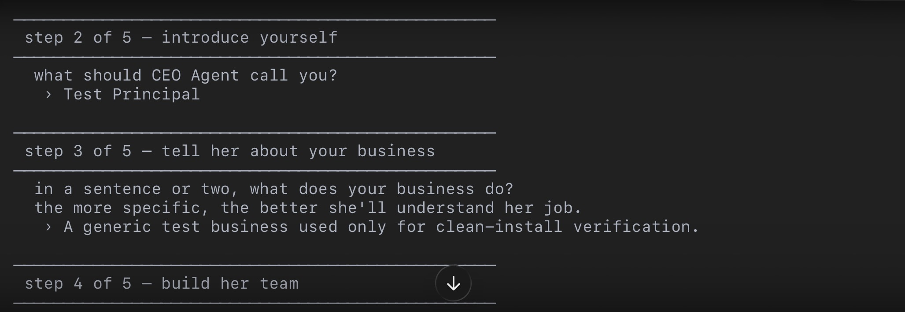
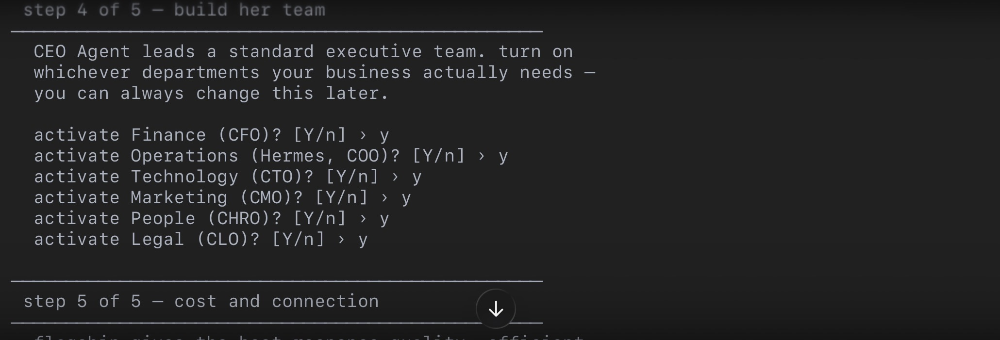
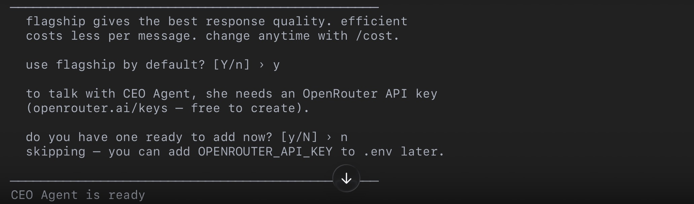
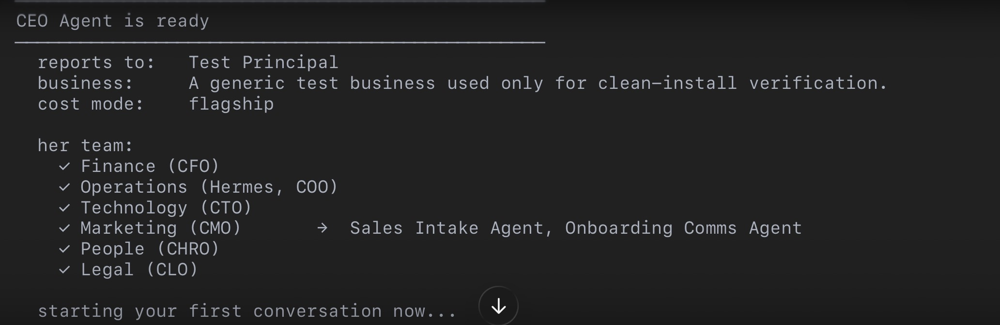
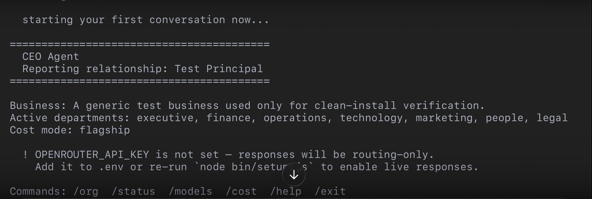

<p align="center">
  <b>The AI that runs your AI workforce.</b>
</p>

<p align="center">
  
  
  
</p>

---

CEO Agent is an orchestration layer that sits above your other AI agents and models. It learns your business, knows who's responsible for what, decides who handles a task, and answers for the outcome — the way a real CEO runs a company, not the way a chatbot answers a question.

**You can rename her on install. The role doesn't change.**

> **Status: working v1.** The white-label identity layer, SDK, organizational model, setup wizard, CLI and local web chat interfaces, dispatch API, workflow execution engine, and safe skill-invocation proof of concept are built and tested. See [Roadmap](#roadmap) for what comes next.

---

## Setup Wizard — Live Walkthrough

Five steps, about two minutes, re-runnable anytime.



<table>
<tr>
<td width="50%">

**Step 1 — Name your agent**



</td>
<td width="50%">

**Step 2 — Introduce yourself**



</td>
</tr>
<tr>
<td width="50%">

**Step 3 — Tell her about your business**



</td>
<td width="50%">

**Step 4 — Build her team**



</td>
</tr>
<tr>
<td width="50%">

**Step 5 — Cost mode and API key**



</td>
<td width="50%">

**Ready — org chart confirmed**



</td>
</tr>
</table>

**First conversation, live:**



*Every department shown here is a real setup toggle: Finance, Operations (Hermes/COO), Technology, Marketing, People, and Legal. Skip the API key and CEO Agent still boots in routing-only mode until you connect a model provider.*

---

## Install and Run It

Not yet published to npm — install from the repository.

```bash
git clone https://github.com/tradersurfer/ceo-agent.git
cd ceo-agent
npm install
npm run setup
```

Requires **Node 18 or newer.** The setup wizard will:

- Name your CEO Agent
- Ask about your business
- Let you activate whichever departments you need
- Choose flagship or efficient cost mode
- Save your OpenRouter key to a local, gitignored `.env`
- Launch straight into the chat interface

After setup, start the CLI again anytime:

```bash
npm start
```

Start the local-only web dashboard:

```bash
npm run web
```

### In-Chat Commands

| Command | Description |
|---|---|
| `/org` | Show your active org chart |
| `/status` | Runtime and agent status |
| `/models` | Resolved model assignments for both cost tiers |
| `/cost` | View or change cost mode (`flagship` or `efficient`) |
| `/help` | Full command list |
| `/exit` | Quit |

Address a department head directly with `@department` — for example, `@legal draft an NDA clause`. Anything else goes to CEO Agent directly.

---

## What Makes This Different

Most AI assistants answer one question at a time. CEO Agent runs the organization: she knows which department head owns which kind of work, delegates to them, and stays accountable for the result — while also answering directly when a task does not need to go anywhere else.

| Capability | Description |
|---|---|
| **Executive orchestration** | Owns the top-level decision layer — decides what gets done, in what order, and by whom |
| **Multi-agent task routing** | Reads incoming work, identifies the right department, and delegates to the appropriate head |
| **Model-agnostic operation** | Resolves current models live through OpenRouter rather than hardcoding stale model identifiers |
| **Cost-aware execution** | Supports flagship and efficient model tiers, prompt caching, and real token-usage reporting |
| **Workflow execution** | Runs dependency chains, conditions, delays, retries, and registered bridge executors |
| **Controlled skills** | Provides a narrow, reviewed skill registry and executor pattern rather than arbitrary script execution |
| **Business-vocabulary interface** | Speaks in business, department, and employee terms instead of agent and prompt jargon |

---

## Supported Models

CEO Agent is model-agnostic. It resolves the **current best available** models live from the OpenRouter catalog into two cost tiers per role (`flagship` / `efficient`). No model IDs are hardcoded — they update automatically as providers release new versions.

| Role | Provider | Icon |
|------|----------|------|
| **Claude** | Anthropic |  |
| **GPT** | OpenAI |  |
| **Gemini** | Google |  |
| **Grok** | xAI |  |
| **Codex** | OpenAI (coding) |  |

Use `/models` in chat to see the live resolved assignments for your current cost mode.

---

## Architecture

```text
                         CEO AGENT
                    Chief Intelligence
                     & Orchestration
                           │
       ┌──────────┬────────┼────────┬──────────┬──────────┐
       ▼          ▼        ▼        ▼          ▼          ▼
      CFO    HERMES/COO   CTO      CMO        CHRO       CLO
    Finance      Ops      Tech   Marketing    People     Legal
                                   │
                         ┌─────────┴──────────┐
                         ▼                    ▼
                    VP of Sales      Onboarding Comms
```

Seven departments, standard C-suite model. **Hermes** fills the COO seat directly (powered by [NousResearch/hermes-agent](https://github.com/NousResearch/hermes-agent)), and Marketing includes a VP of Sales plus onboarding communications. The domain-specific Dispute Agent remains under `examples/` as an optional reference implementation and is not activated in the default roster. Activate only the departments your business needs. See [`ARCHITECTURE.md`](./ARCHITECTURE.md) for the full model.

---

## Swarm Agents

CEO Agent coordinates a growing multi-agent swarm under the C-suite.

| Agent | Status | Role | Icon |
|-------|--------|------|------|
| **Hermes** | Active | Chief Operating Officer / Ops bridge & workflow executor |  |
| **OpenClaw** | Coming soon | Swarm agent |  |
| **T3Agent** | Coming soon | Swarm agent |  |

---

## WORKSPACES™️

**Coming soon** — WORKSPACES™️ with **Buzz by Block** (relay Workspace connect).

This will enable secure, relay-based workspace connectivity so CEO Agent and the swarm can operate across distributed environments while keeping tenant isolation and auditability intact.

---

## What's In This Repo

| Path | What it is |
|---|---|
| `IDENTITY.md` | The CEO Agent's white-label identity template |
| `departments/` | C-suite identity documents and department-specific bridges |
| `core/` | Runtime configuration, departments, model routing, workflows, and skill execution |
| `sdk/` | Agent lifecycle, task routing, memory, permissions, prompts, and provider clients |
| `organization/` | The programmatic C-suite organizational model |
| `registry/agent-registry.json` | Canonical built-in agent roster and reporting structure |
| `bin/setup.js` | Interactive CLI setup wizard shown above |
| `bin/chat.js` | CLI chat with live model calls, cost switching, org chart, and status |
| `app/` | Local web dashboard and API routes for chat, configuration, status, org data, agents, and dispatch |
| `departments/operations/hermes/` | Hermes, the Operations department head and bridge, powered by [NousResearch/hermes-agent](https://github.com/NousResearch/hermes-agent) |
| `departments/marketing/sales-intake/` | Marketing-owned sales intake bridge |
| `departments/marketing/onboarding-comms/` | Marketing-owned onboarding communications bridge |
| `examples/dispute-agent/` | Optional domain-specific reference implementation; not in the default roster |
| `tests/` | 27 automated suites with 166 tests covering workflows, bridges, skills, persistence, scheduling, rate limiting, health reporting, custom agents, runtime parity, and user messages |
| `ARCHITECTURE.md` | The full department and agent product model |
| `SECURITY.md` | Current security posture, known limitations, and installer responsibilities |
| `TASK_ROUTER.md`, `BEHAVIOR.md`, `ORGANIZATION-STRUCTURE.md` | Reference behavior and routing specifications |

---

## Who This Is For

- A solo entrepreneur operating a local business
- A CFO or CEO who wants an executive AI layer over an existing technology stack
- A small-business owner coordinating multiple specialized AI tools or agents
- A developer building a white-label multi-agent installation

Available through both the CLI and the local-only web dashboard.

---

## Roadmap

- [x] White-label identity layer
- [x] Core SDK for task routing, memory, permissions, and agent lifecycle
- [x] Standard C-suite organizational model
- [x] Department-head identity and prompt documents
- [x] Operations and Marketing agent bridges, plus an optional Legal reference example
- [x] Installer and setup wizard
- [x] CLI chat with live model resolution and cost-mode switching
- [x] Local web dashboard for chat, org chart, status, settings, and custom agents
- [x] Dispatch API with authentication and rate limiting
- [x] Workflow execution engine wired to registered bridge executors
- [x] Safe skill-registry and executor proof of concept
- [x] Cost and token optimization with dual-tier models, prompt caching, and usage visibility
- [x] Security hardening and documented limitations
- [x] Persistent workflow storage and audit log (Supabase-backed)
- [x] Scheduler for delayed workflow steps
- [x] Idempotency / duplicate-execution protection
- [x] Multi-instance/shared rate limiting for hosted deployments (Supabase-backed)
- [x] Health checks and observability
- [x] Curated department skills: scope-creep detection, schema markup generation, content-quality analysis
- [x] Hermes (COO / Ops) active in the default roster
- [ ] Direct-provider adapter evaluation beyond OpenRouter
- [ ] Swarm agents: OpenClaw & T3Agent
- [ ] WORKSPACES™️ — relay Workspace connect with Buzz by Block
- [ ] Marketplace listing

Some install-specific pieces remain configurable by design: production runtime URLs for bridges, persistent storage, scheduling, model credentials, and deployment infrastructure.

---

## Security

The included web commands bind to `127.0.0.1` by default. The dispatch and chat APIs rate-limit by caller: an in-memory sliding window by default, and a Supabase-backed shared limiter automatically when `SUPABASE_URL`/`SUPABASE_SERVICE_ROLE_KEY` are configured, for multi-instance deployments. Hosted deployments still need TLS termination, authentication appropriate to their environment, and a reviewed secrets-management process.

See [`SECURITY.md`](./SECURITY.md) before deploying beyond a single local machine.

---

## License

MIT — see [`LICENSE`](./LICENSE). Copyright (c) 2026 JECI Group, LLC.

---

## Contributing

Issues and pull requests are welcome. Please avoid committing credentials, tenant-specific business data, personal paths, or private installation details.
